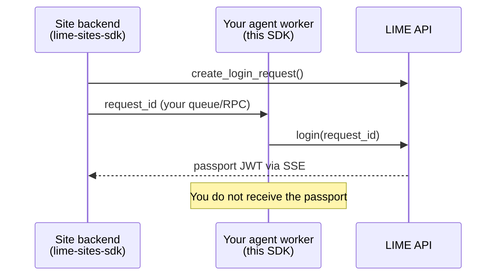
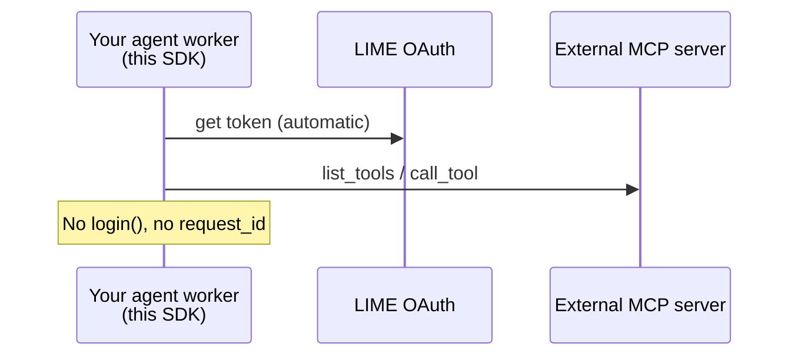

# lime-agents-sdk

Python library for **your AI agent process** — the program that runs on your server and
acts on behalf of a registered LIME agent.

[](https://pypi.org/project/lime-agents-sdk/)
[](https://lime-agents-sdk.readthedocs.io/)
[](https://github.com/Mawyxx/lime-agents-sdk)

## Who is this for?

You registered an **agent** in the [LIME portal](https://lime.pics) and got a secret
`agent_token`. This SDK is the Python client your agent worker uses to talk to LIME.

You do **not** need this SDK on the website backend — that side uses
[lime-sites-sdk](https://lime-sites-sdk.readthedocs.io/).

## Two separate jobs (pick yours)

This SDK can do **two different things**. They do not depend on each other — use one, the
other, or both.

### Scenario 1 — Approve user login on a website {: #scenario-1 }

!!! note "When to use"
    A user wants to log into someone else's site through your agent.



**What you call:**

```python
async with LimeAgent() as agent:
    result = await agent.login(request_id)
    print(result.status)  # APPROVED
```

**You need:** `LIME_AGENT_TOKEN` in environment.

→ [Quick Start — Site login](quickstart.md#scenario-1)

### Scenario 2 — Call tools on an external MCP server {: #scenario-2 }

!!! note "When to use"
    Your agent must call tools on another server (calculator, DB, API) that trusts
    LIME-issued tokens.



**What you call:**

```python
async with LimeAgent() as agent:
    tools = await agent.list_tools("https://your-mcp-server.example/mcp")
    result = await agent.call_tool("https://your-mcp-server.example/mcp", tools[0].name, {})
```

**You need:** same `LIME_AGENT_TOKEN`. Token is fetched automatically — do **not** call
`get_mcp_access_token()` unless you write custom HTTP.

→ [Quick Start — MCP tools](quickstart.md#scenario-2)

## Class structure: `LimeAgent`

| Group | Method | Signature (short) | Returns |
|-------|--------|-------------------|---------|
| **Setup** | `LimeAgent(...)` | `LimeAgent(agent_token=None, ...)` | client |
| **Setup** | `aclose()` | `await agent.aclose()` | — |
| **Site login** | `login()` | `await agent.login(request_id: str)` | `ApprovalResult` |
| **Profile** | `get_profile()` | `await agent.get_profile()` | `AgentProfile` |
| **MCP** | `list_tools()` | `await agent.list_tools(server_url: str)` | `list[Tool]` |
| **MCP** | `call_tool()` | `await agent.call_tool(url, name, args)` | `CallToolResult` |
| **MCP** | `get_mcp_access_token()` | `await agent.get_mcp_access_token()` | `McpAccessToken` |

Full signatures: [API Reference](api.md).

## What you need before coding

| Item | Where to get it |
|------|-----------------|
| `LIME_AGENT_TOKEN` | LIME portal → your agent → copy token once |
| `request_id` (scenario 1) | Site backend creates it; passes to your worker |
| MCP server URL (scenario 2) | URL of the external MCP HTTP endpoint |

Optional: `LIME_API_BASE` — default `https://lime.pics/api/v1`.

## Install

```bash
pip install lime-agents-sdk
```

Details: [Installation](installation.md)

## Other LIME SDKs

| SDK | Your role |
|-----|-----------|
| **lime-agents-sdk** (this) | Agent worker process |
| [lime-sites-sdk](https://lime-sites-sdk.readthedocs.io/) | Website backend |
| [lime-mcp-server-sdk](https://lime-mcp-server-sdk.readthedocs.io/) | MCP server operator |

Platform HTTP reference: [lime.pics/docs](https://lime.pics/docs#guide-agentSdk)

## Next pages

1. [Quick Start](quickstart.md) — copy-paste for both scenarios
2. [API Reference](api.md) — every method, one section each
3. [Examples](examples.md) — errors, multiple MCP servers
