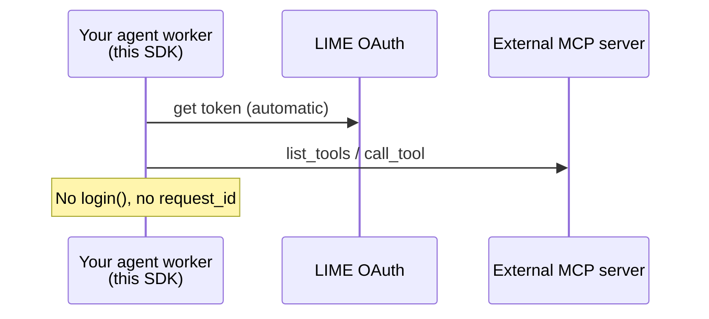
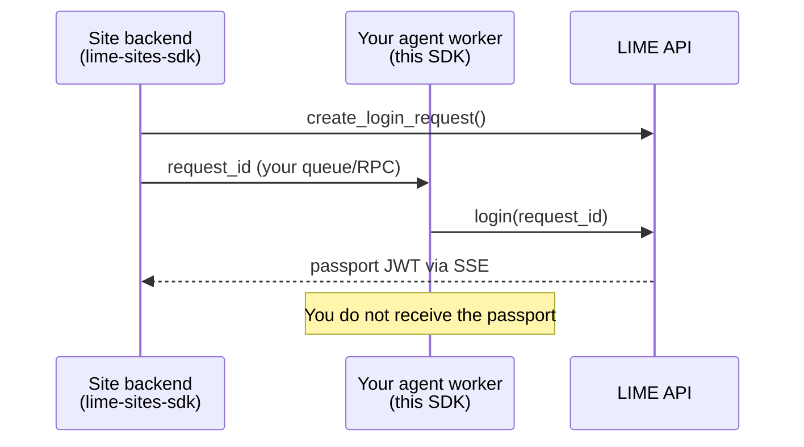

# lime-agents-sdk

Give your AI agent a **verifiable LIME identity** and call **MCP tools** without managing OAuth tokens yourself.

```python
async with LimeAgent() as agent:
    tools = await agent.list_tools("https://your-mcp-server.example/mcp")
    result = await agent.call_tool("https://your-mcp-server.example/mcp", tools[0].name, {})
```

[](https://pypi.org/project/lime-agents-sdk/)
[](https://lime-agents-sdk.readthedocs.io/)
[](https://github.com/Mawyxx/lime-agents-sdk)

## Who is this for?

You registered an **agent** in the [LIME portal](https://lime.pics) and got a secret
`agent_token`. This SDK is the Python client your **agent worker** uses.

You do **not** need this SDK on the website backend — that side uses
[lime-sites-sdk](https://lime-sites-sdk.readthedocs.io/).

## Mental model

```text
LimeAgent
├── Core          construct / aclose
├── MCP           list_tools · call_tool · resources · prompts   ← primary
├── Profile       get_profile
├── Advanced      get_mcp_access_token(target) · mcp_session
└── Site login    login(request_id)                              ← optional
```

| Credential | Header | Used for |
|------------|--------|----------|
| Agent Token | `X-Agent-Token` | LIME APIs only |
| MCP JWT | `Authorization: Bearer` | External MCP RS only |

## Two jobs (pick yours)

### Primary — Call tools on an external MCP server {: #scenario-2 }

!!! note "When to use"
    Your agent must call tools on another server that trusts LIME-issued tokens.


```mermaid
sequenceDiagram
    participant Agent as Your agent worker<br/>(this SDK)
    participant LIME as LIME OAuth
    participant MCP as External MCP server

    Agent->>LIME: get token (automatic)
    Agent->>MCP: list_tools / call_tool
    Note over Agent: No login(), no request_id
```

```python
async with LimeAgent() as agent:
    tools = await agent.list_tools("https://your-mcp-server.example/mcp")
    result = await agent.call_tool("https://your-mcp-server.example/mcp", tools[0].name, {})
```

Token is fetched automatically (**lazy refresh** ~30s before expiry). Do **not** call
`get_mcp_access_token(target)` unless you write custom HTTP.

→ [Quick Start — MCP](quickstart.md#scenario-mcp) · [MCP OAuth & pool](mcp-oauth.md)

### Optional — Approve site login {: #scenario-1 }

!!! note "When to use"
    A user wants to log into a site through your agent.


```mermaid
sequenceDiagram
    participant Site as Site backend<br/>(lime-sites-sdk)
    participant Agent as Your agent worker<br/>(this SDK)
    participant LIME as LIME API

    Site->>LIME: create_login_request()
    Site->>Agent: request_id (your queue/RPC)
    Agent->>LIME: login(request_id)
    LIME-->>Site: passport JWT via SSE
    Note over Agent: You do not receive the passport
```

```python
async with LimeAgent() as agent:
    result = await agent.login(request_id)
    print(result.status)  # APPROVED
```

→ [Quick Start — Site login](quickstart.md#scenario-1)

## Class structure: `LimeAgent`

| Group | Method | Returns |
|-------|--------|---------|
| **Setup** | `LimeAgent(...)`, `aclose()` | client |
| **MCP** | `list_tools`, `call_tool`, … | typed MCP models |
| **Profile** | `get_profile()` | `AgentProfile` |
| **Site login** | `login(request_id)` | `ApprovalResult` |
| **Advanced** | `get_mcp_access_token(target)`, `mcp_session` | raw JWT / session |

Full signatures: [API Reference](api.md).

## What you need before coding

| Item | Where to get it |
|------|-----------------|
| `LIME_AGENT_TOKEN` | LIME portal → your agent → copy once |
| MCP server URL (primary) | URL of the external MCP HTTP endpoint |
| `request_id` (site login only) | Site backend creates it; passes to your worker |

Optional: `LIME_API_BASE` — default `https://lime.pics/api/v1`.

## Install

```bash
pip install lime-agents-sdk
export LIME_AGENT_TOKEN=at_...
```

Details: [Installation](installation.md)

## Other LIME SDKs

| SDK | Your role |
|-----|-----------|
| **lime-agents-sdk** (this) | Agent worker process |
| [lime-sites-sdk](https://lime-sites-sdk.readthedocs.io/) | Website backend |
| [lime-mcp-server-sdk](https://lime-mcp-server-sdk.readthedocs.io/) | MCP server operator |

Platform HTTP reference: [lime.pics/docs](https://lime.pics/docs#guide-agentSdk)

## Next pages

1. [Quick Start](quickstart.md) — MCP first, then site login
2. [MCP OAuth & pool](mcp-oauth.md) — lazy refresh, multi-server, retries
3. [API Reference](api.md) — every method
4. [Examples](examples.md) — errors, multiple MCP servers
