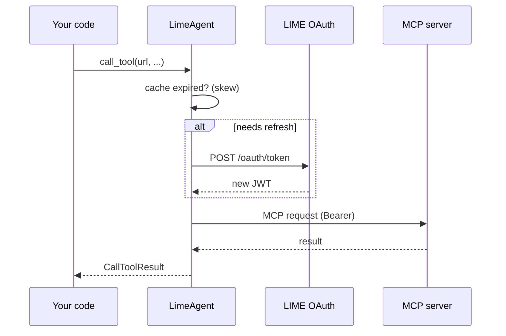

# MCP OAuth & connection pool

How the SDK handles MCP tokens, sessions, and retries — **scenario 2** internals.

## Lazy token refresh (not background)

The SDK does **not** run a background timer or `asyncio` task to refresh JWTs.

| Step | What happens |
|------|----------------|
| 1 | You call `list_tools`, `call_tool`, or another MCP method |
| 2 | SDK calls `get_access_token()` internally |
| 3 | If cache is valid (`elapsed < expires_in - refresh_skew`), cached JWT is reused |
| 4 | If near expiry, one coroutine fetches `POST /modules/oauth/token` under a lock (single-flight); others wait and reuse the result |
| 5 | MCP `ClientSession` reconnects when token **generation** changes |

Default platform TTL is **300 seconds (5 minutes)**. Default `mcp_token_refresh_skew` is **30** — the token is treated as expired for cache purposes at **270s**, so the **next** MCP call after that window refreshes before talking to the resource server.



!!! tip "Long LLM think time"
    If your agent spends minutes reasoning **without** MCP calls, the first tool call
    after idle still refreshes the token automatically (lazy). No extra code required.

!!! warning "What lazy refresh does not do"
    It does not refresh while your process is idle with zero MCP traffic. If you need a
    fresh JWT without calling MCP, use `await agent.get_mcp_access_token(force_refresh=True)`.

## One JWT, many MCP servers

One `LimeAgent` shares a single OAuth cache for all MCP URLs. That matches LIME's model:
one agent identity → one short-lived `aud=mcp` JWT used on every external resource server.

## Connection pool

| Concept | Behavior |
|---------|----------|
| Per-URL session | One pooled `ClientSession` per unique `server_url` |
| Reuse | Repeated calls to the same URL reuse the session (faster) |
| Parallel different URLs | Calls to `mcp-a` and `mcp-b` can run concurrently |
| Same URL (default) | `serialize_mcp_per_url=True` — one in-flight MCP op per URL |
| Shutdown | `aclose()` closes entries **sequentially** to avoid streamable HTTP teardown races |

```python
import asyncio
from lime_agents import LimeAgent

async def main() -> None:
    async with LimeAgent() as agent:
        tools_a, tools_b = await asyncio.gather(
            agent.list_tools("https://mcp-a.example/mcp"),
            agent.list_tools("https://mcp-b.example/mcp"),
        )
        print(len(tools_a), len(tools_b))

asyncio.run(main())
```

## Retries

| Layer | Retries |
|-------|---------|
| **LIME platform** (`login`, `get_profile`, OAuth token) | Exponential backoff on 408, 429, 5xx (`max_retries`, default 3) |
| **MCP calls** | No generic 5xx retry; **401** → refresh JWT + one retry; broken session → close + one retry |

## 401 handling

If an MCP resource server rejects the Bearer token:

1. SDK calls `invalidate_and_refresh()`
2. Closes pooled transports (all URLs)
3. Retries the operation once
4. Raises `McpAuthenticationError` if still rejected

## Configuration

| Parameter | Default | Meaning |
|-----------|---------|---------|
| `mcp_token_refresh_skew` | `30.0` | Seconds before `expires_in` to treat JWT as stale |
| `serialize_mcp_per_url` | `True` | Serialize MCP ops per URL |
| `mcp_read_timeout` | `300.0` | MCP HTTP read timeout (seconds) |

## Related

- [Quick Start — MCP tools](quickstart.md#scenario-2)
- [Examples — multiple servers](examples.md#scenario-2-multiple-mcp-servers)
- [API Reference](api.md)
